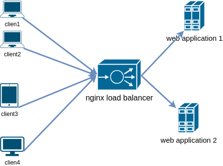

# vagrant-3-vm-shell-provisioner

We assume an application hosted on a server. This application has encountered success, leading to a growing number of users connecting to the server, resulting in increasing the workload over time.

Consequently, a solution will need to be proposed to make the infrastructure highly available by adding additional servers. This will allow the workload to be easily managed through the addition of these extra resources. In fact, this is referred to as horizontal scaling.

Let's consider the following architecture : 

 Architecture 

Create a Vagrantfile in order to configure 3 VMs based on the following information 

The website . 