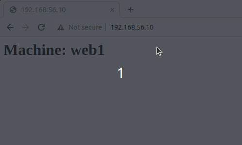

# vagrant-3-vm-shell-provisioner

We assume a web application hosted on a server. This web app has encountered success, leading to a growing number of users connecting to the server, resulting in increasing the workload over time.

Any proposed solution should make the infrastructure highly available by adding additional servers. This will allow the workload to be easily managed through adding these extra resources. Hence, this is referred to as horizontal scaling.

Our solution consists on : 
1. duplicating the web application to be executed on a second server
2. distribute traffic across both servers in order to improve performance, scalability and reliability. 
 Let's consider the following architecture that illustrates the needed resources.  

<p align="center">

</p>
<p align="center"> Architecture </p>

To deploy quickely these 3 virtual machines (VMs), we can use the vagrant tool that allows us to instanciate them in a couple of minutes by using a simple vagrant file.

Let's write Vagrantfile in order to configure 3 VMs based on the following information :
- base image : ubuntu/xenial64
- CPU : 1
- RAM : 1Go
- VM1: lb, ip: 192.168.56.10 
- VM2: web1, ip: 192.168.56.11
- VM3: web2, ip: 192.168.56.12

To create a short template of the Vagrantfile, we run the following command : 
```
vagrant init ubuntu/xenial64 -m
``` 
This generates the Vagrantfile template 
```
Vagrant.configure("2") do |config|
  config.vm.box = "ubuntu/xential64"
end
```

We complete this template to define the configuration of each virtual machine by : 
- specifying the ubuntu/xential64 box
- setting a private network with a valid IP address 
- provisionning the VM with a shell script from a specific URL
- setting the memory and CPU configuration when defining the used provider (virtualbox in this case)

To validate the Vagrantfile, we run : 
```
vagrant validate
``` 

To provision the VMs defined in the Vagrantfile run the command: 
```
vagrant up
```

To test our solution on internet browser, we can see that for each http request a web application is selected alternatively.

<p align="center">

</p>
<p align="center"> Architecture </p>